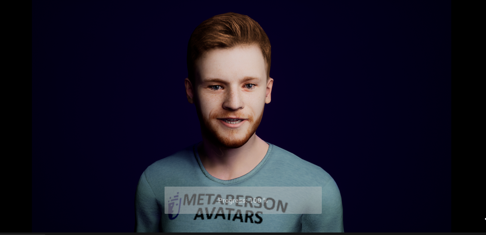

# MetaPerson - Unreal Engine Oculus LipSync sample

This sample demonstrates how to use [MetaPerson](https://metaperson.avatarsdk.com/) avatars in Unreal Engine with [Oculus LipSync](https://developer.oculus.com/documentation/unreal/audio-ovrlipsync-unreal/) plugin.

## Requirements

- UE 5.2 or newer
- VS 2022

## Getting Started

You need to complete the following steps before experimenting with this sample:

1. Install UE5.2 (or newer) and Visual Studio 2022
2. Clone this repository to your computer
3. Create a Visual Studio 2022 project by right-clicking on metaperson_oculus.uproject and clicking "Generate Visual Studio Files".
4. Compile and Run Visual Studio project
5. Run the MetapersonMap level and see how the MetaPerson avatar on the scene is animated with Oculus LipSync

6. Click on the button or press the "L" key and wait for another MetaPerson avatar to be downloaded replacing the original one

## How does it work

## License

This OVRLipSync plugin is the property of Oculus and is provided under the [Oculus SDK License](https://developer.oculus.com/licenses/audio-3.3/), which allows for personal and commercial use of the plugin. By using this plugin, you agree to the terms of the Oculus SDK License.

## Support

If you have any questions or issues with the sample, please contact us <support@avatarsdk.com>.