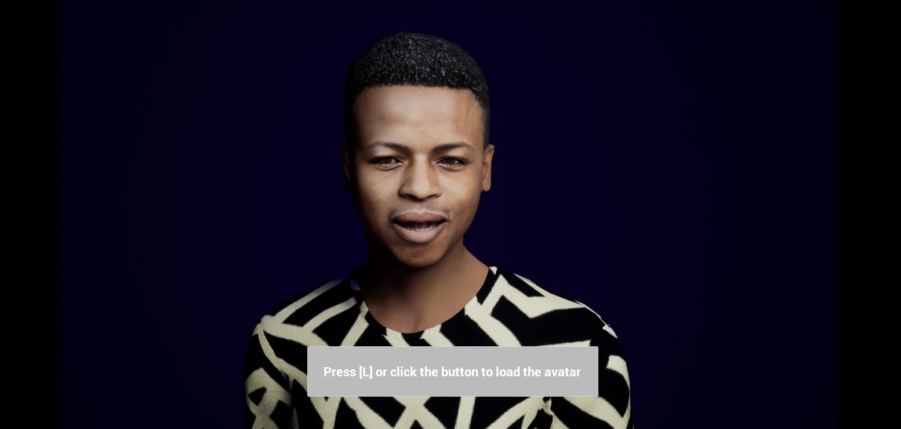

# MetaPerson - Unreal Engine Oculus LipSync sample

This sample demonstrates using [MetaPerson](https://metaperson.avatarsdk.com/) avatars in Unreal Engine with the [Oculus LipSync](https://developer.oculus.com/documentation/unreal/audio-ovrlipsync-unreal/) plugin.

## Requirements

- UE 5.2 or newer
- VS 2022

## Getting Started

You need to complete the following steps before experimenting with this sample:

1. Install UE5.2 (or newer) and Visual Studio 2022.
2. Clone this repository to your computer.
3. Create a Visual Studio 2022 project by right-clicking on metaperson_oculus.uproject and clicking `Generate Visual Studio Files`.
4. Compile and Run Visual Studio project.
5. Run the MetapersonMap level and see how the MetaPerson avatar on the scene is animated with the Oculus LipSync.

6. Click on the button or press the `L` key and wait for another MetaPerson avatar to be downloaded replacing the original one

## How does it work

This demo project includes two plugins: AvatarSDKMetaperson2 for loading and setting up avatars, and OVRLipSync for managing LipSync. The MetapersonLipsyncActor blueprint represents an animated avatar on the scene and has two corresponding Actor Components attached: AvatarSDK and OVRLipsyncPlaybackActor. It also has the Voice audio component for playing the audio asset.

In the BeginPlay event handler of the mentioned blueprint we set up the `AvatarSDK` actor component by providing the skeletal mesh reference and call the Start method of the `OVRLipsyncPlaybackActor`. The Start function in the `UOVRLipSyncPlaybackActorComponent` class takes two parameters: `InAudioComponent` and `InSequence`. The `InAudioComponent` parameter is of type `UAudioComponent` and represents the audio component that will be used for LipSync playback. It is responsible for playing the audio associated with the LipSync animation. The InSequence parameter is of type UOVRLipSyncFrameSequence and represents the sequence of LipSync frames that will be played back. It contains information about the viseme scores and laughter score for each frame of the LipSync animation. 

By passing these parameters to the Start function, we initiate the LipSync playback using the mentioned `Voice` component reference and LipSync frame sequence. To generate the LipSync frame sequence, import your file as Sound Wave asset in editor, click the right mouse button on it, and choose the `Generate LipSync Sequence` option. New sequence will appear in the content browser.

In the `On Visemes Ready` event handler of the OVRLipsyncPlaybackActor object, we simply call the `AssignVisemesToMorphTargets` method and pass our skeletal mesh reference to it.

When we press the `L` key or click on the corresponding button, the OnLoadAvatar event is called. 

In it's handler we simply execute the DownloadAvatar routine and pass the predefined avatar url to it. This method downloads avatar glb file and loads the skeletal mesh from it. After that the new mesh is set to our avatar blueprint and the LipSync animation continues to play.

## License

This OVRLipSync plugin is the property of Oculus and is provided under the [Oculus SDK License](https://developer.oculus.com/licenses/audio-3.3/), which allows for personal and commercial use. By using this plugin, you agree to the terms of the Oculus SDK License.

## Support

If you have any questions or issues with the sample, please contact us <support@avatarsdk.com>.
